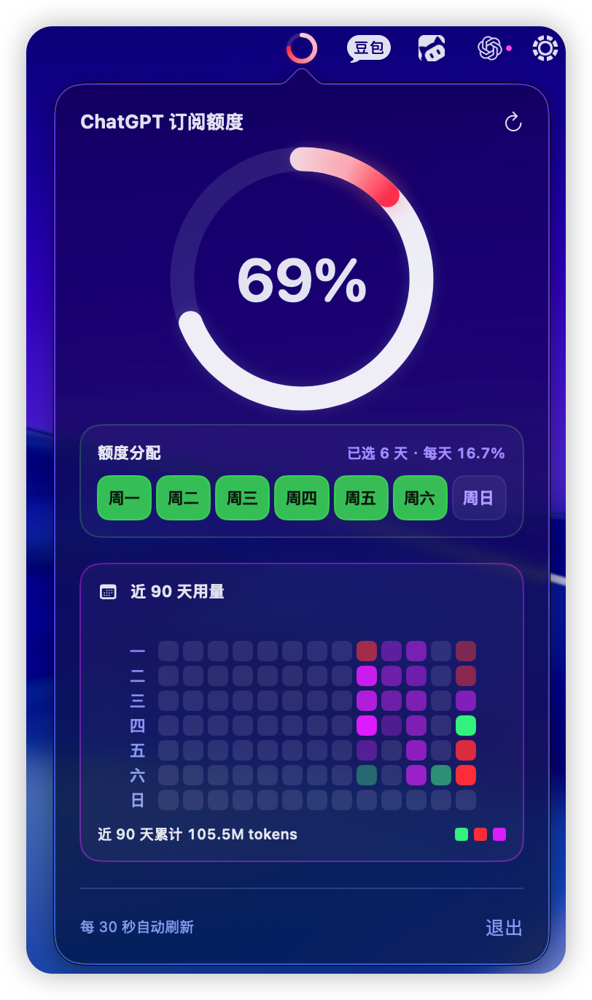

# ChatGPT 订阅额度监控 V2

[English](#english) | 中文

一个轻量的 macOS 菜单栏应用。它从**本机 Codex 会话记录**读取 7 天额度事件，显示当前 7 天已用比例、按你的工作日计划计算的每日额度节奏，以及近 90 天 token 用量热力图。

> 非官方项目，与 OpenAI 或 ChatGPT 没有隶属、认可或合作关系。

## 界面预览



截图为 V2 的实际界面示例：当前 7 天额度为 69%，已选择周一至周六作为额度计划，因此每天分配 16.7%。下方热力图显示近 90 天的本机 Codex token 用量。

## V2 新功能：自定义额度分配

V2 增加了 **额度分配** 面板。你可以点击周一至周日，选择自己通常使用 Codex 的工作日：

- 默认选中**周一至周六**，即 6 天计划，每天为 7 天总额度的 **16.7%**。
- 选中的日期以绿色显示，未选中的日期会变暗。
- 每日额度自动计算为 `100% ÷ 已选天数`。例如选 5 天时，每天为 20%；选 7 天时，每天约为 14.3%。
- 选择会保存在本机；下次打开应用时继续使用同一计划。

这项设置**不会改变你的 ChatGPT/Codex 实际额度**，只改变应用用来判断“今天是否用得过快”的个人节奏基线。

## 如何阅读面板

### 1. 中央 7 天额度圆环

中央的大号百分比和白色圆环来自本机 Codex 记录中的 7 天额度事件：

- `69%` 表示当前 7 天额度窗口已使用 69%。
- 白色圆环越完整，表示已用比例越高。
- 如果没有找到符合条件的本机记录，应用显示 `—`，不会猜测或编造额度数值。

### 2. 彩色今日用量叠加环

白色圆环上方的彩色弧线代表**今天增加的额度消耗**，并以“每天分配额度”为单位判断节奏。只有今天被包含在你的额度计划中时才会显示这条弧线。

| 颜色 | 今日增加的额度消耗 |
| --- | --- |
| 绿色 | 不超过 1 份每日额度 |
| 红色 | 超过 1 份，但不超过 2 份每日额度 |
| 紫色 | 超过 2 份每日额度 |

例如，使用默认 6 天计划时，每日一份是 16.7%。如果今天增加了约 20% 的 7 天额度，叠加环会进入红色区间。当天是未选工作日时，应用不会把它标记为超额。

### 3. 额度分配面板

面板会显示“已选 X 天 · 每天 Y%”，让你随时确认当前计划。点击星期按钮立即切换；新计划会同时用于：

- 菜单栏小圆环的今日节奏颜色；
- 主圆环上的彩色今日用量叠加环；
- 90 天用量区域的当前节奏提示色。

### 4. 近 90 天用量热力图

下半部分按周排列、按星期显示最近 90 天的本机 Codex 记录：

- **灰色格子**：该日没有找到本机记录。
- **绿色、红色、紫色格子**：该日有记录；颜色表示相对额度节奏，亮度表示提取到的 token 用量规模。
- 悬停单个格子可以查看日期和该日 token 数；不悬停时，底部显示近 90 天累计 token 数。

## 刷新与使用方式

- 应用启动时立即读取本机记录，之后每 30 秒自动刷新一次。
- 点击标题右上角的刷新图标可立即重新读取。
- 应用会在菜单栏显示一个小圆环；点击它可快速打开监控面板。
- 面板底部的“退出”会关闭应用。

## 数据来源、隐私与限制

应用只读取当前用户电脑中的以下目录：

- `~/.codex/sessions`
- `~/.codex/archived_sessions`

它仅提取展示与计算所需的额度百分比、额度重置时间、事件时间和 `last_token_usage.total_tokens` 字段。应用不会修改这些文件，不需要 API Key，不登录 ChatGPT 网页，不发起网络请求，也不会上传或额外保存会话内容。

这是一个**本机 Codex 记录查看器**，不是 ChatGPT 全平台账单或所有模型用量统计器。若历史记录中没有 7 天额度事件、记录格式改变，或刚开始使用 Codex，应用会显示空状态；这不代表你的实际额度为零。

## 系统要求

- macOS 14 或更高版本
- Apple Silicon Mac（默认构建为 arm64）
- Xcode Command Line Tools（包含 `swiftc`、`iconutil` 和 `codesign`）

安装命令行工具：

```zsh
xcode-select --install
```

## 构建与运行

```zsh
git clone https://github.com/wx61666-a11y/chatgpt-subscription-quota-monitor.git
cd chatgpt-subscription-quota-monitor
./scripts/build.sh
open 'build/ChatGPT 订阅额度监控 V2.app'
```

构建产物使用 ad-hoc 签名。若 macOS 在首次运行时拦截它，请在“系统设置 → 隐私与安全性”中选择允许打开。

## 许可证

本项目基于 [MIT License](LICENSE) 发布。

## English

ChatGPT Subscription Quota Monitor V2 is a lightweight macOS menu-bar app that reads local Codex session records to show the current 7-day quota percentage, a user-configurable daily pacing baseline, and a 90-day token-usage heatmap.

### V2: configurable quota allocation

Choose the weekdays on which you normally use Codex. V2 divides the 7-day quota evenly across those selected days, remembers the selection locally, and uses it only as a pacing baseline. It does not change the actual ChatGPT or Codex quota.

- The central white ring shows the 7-day quota percentage from local rate-limit events.
- The colored overlay shows today's increase relative to one selected-day allocation: green is within one allocation, red is between one and two, and purple is above two.
- The 90-day heatmap uses gray for days without local records. Colored cells indicate local activity; color reflects pace and brightness reflects extracted token-use scale.

### Privacy and limitations

The app reads JSONL files from `~/.codex/sessions` and `~/.codex/archived_sessions` on-device. It extracts quota percentage, reset time, event time, and `last_token_usage.total_tokens` for display. It does not require an API key, sign in to the ChatGPT website, modify the source files, make network requests, upload data, or persist session content.

This is an unofficial project and is not affiliated with, endorsed by, or sponsored by OpenAI or ChatGPT.
