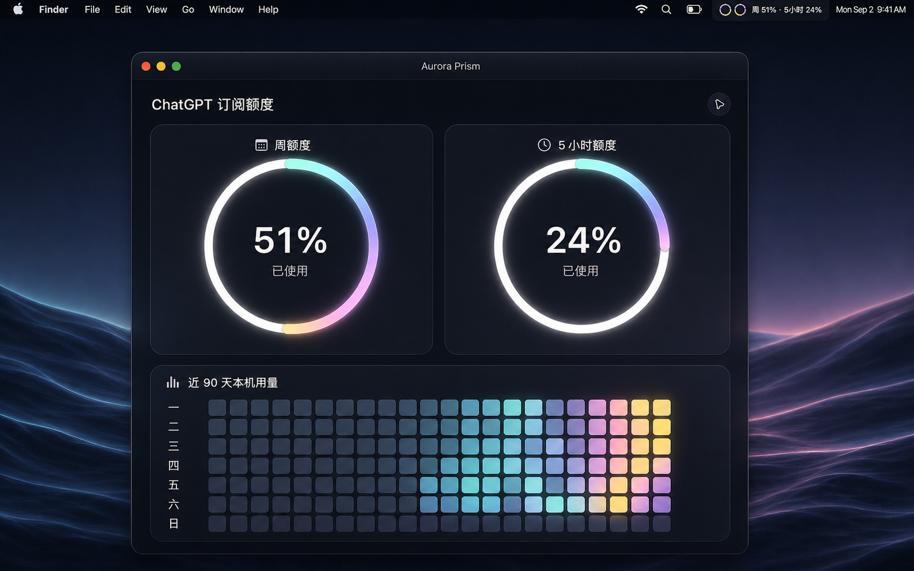
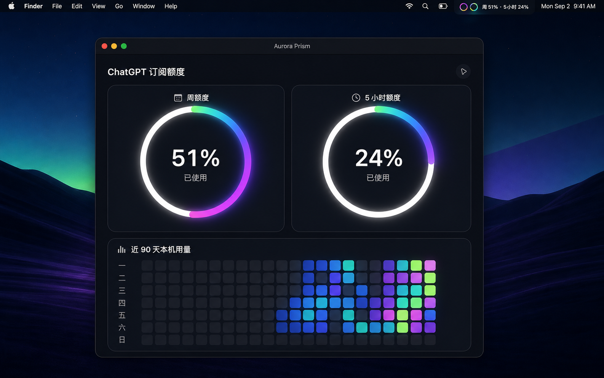
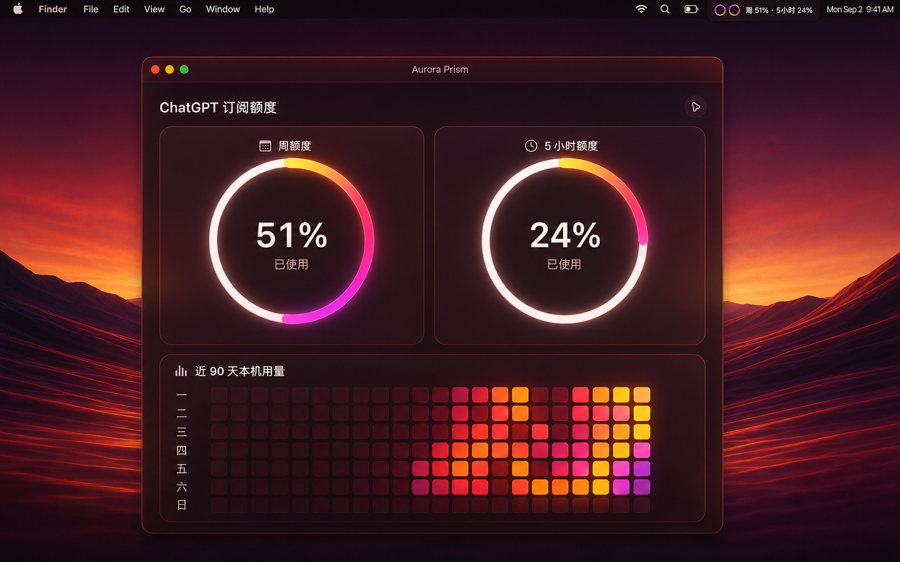

## 界面预览
# ChatGPT Subscription Quota Monitor V3
## 界面预览

<table>
  <tr>
    <td width="33%" align="center">
      
    </td>
    <td width="33%" align="center">
      
    </td>
    <td width="33%" align="center">
      
    </td>
  </tr>
</table>

一个面向 macOS 的本机 ChatGPT / Codex 订阅额度监控工具。应用实时读取本机 Codex 会话记录，显示周额度、5 小时额度和近 90 天本机用量，所有数据均在本机处理。

## 主要功能

- macOS 菜单栏双圆环额度状态，点击打开完整面板
- 周额度与 5 小时额度独立显示
- 彩色弧线从顶部跑到消耗位置，停留 0.5 秒后循环
- 白色底环、七彩发光渐变和三套界面皮肤
- 近 90 天本机用量热力图
- 菜单栏周额度、5 小时额度和文字独立开关

## 数据与隐私

应用仅读取当前用户电脑中的：

```text
~/.codex/sessions
~/.codex/archived_sessions
```

它不需要 API Key，不登录网页，不读取 Cookie，不修改或上传会话内容。额度解析与用量统计均在本机完成。

## 下载

从 [最新 Release](https://github.com/wx61666-a11y/chatgpt-subscription-quota-monitor/releases/latest) 下载 DMG，打开后将应用拖入“应用程序”。当前构建面向 Apple Silicon Mac。

首次运行若被 Gatekeeper 拦截，请在“系统设置 → 隐私与安全性”中允许打开。

## 从源码运行

需要 Node.js 和 npm：

```bash
git clone https://github.com/wx61666-a11y/chatgpt-subscription-quota-monitor.git
cd chatgpt-subscription-quota-monitor
npm install
npm start
```

构建 DMG：

```bash
npm run dist:mac
```

## Release

提交信息以 `Release v` 开头时，GitHub Actions 会自动构建并发布 DMG。最新版固定地址：

```text
https://github.com/wx61666-a11y/chatgpt-subscription-quota-monitor/releases/latest
```

## 项目定位

这是一个本机 Codex 使用记录查看器与额度监控工具，不是 OpenAI 官方客户端、额度 API 或账单系统。实际数据取决于本机已有记录。

## License

MIT License，详见 [LICENSE](LICENSE)。

---

## English

ChatGPT Subscription Quota Monitor V3 is a local macOS menu-bar application for monitoring ChatGPT / Codex subscription quota.

Features include weekly and 5-hour quota rings, a white base ring with a glowing rainbow progress arc, three themes, a 90-day local usage heatmap, and independent menu-bar display toggles.

The app reads only local Codex JSONL records from `~/.codex/sessions` and `~/.codex/archived_sessions`. It does not require an API key, sign in to a website, read cookies, modify session files, or upload local content.

Download the latest DMG from the [latest Release](https://github.com/wx61666-a11y/chatgpt-subscription-quota-monitor/releases/latest). Build locally with `npm install`, `npm start`, and `npm run dist:mac`.

This is an unofficial MIT-licensed project and is not affiliated with OpenAI, ChatGPT, or Codex.
